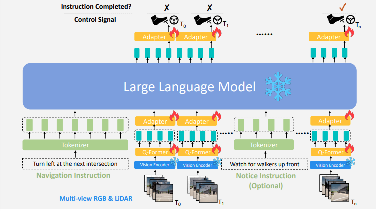
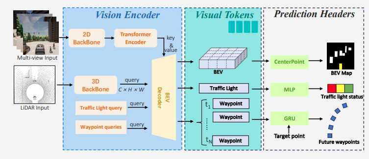

# LMDrive: Closed-Loop End-to-End Driving with Large Language Models [CVPR2024]
### 🔥 **论文链接：**  
- [LMDrive: Closed-Loop End-to-End Driving with Large Language Models](https://arxiv.org/abs/2312.07488)  
### 🔥 **代码链接：**  
- [GitHub - LMiDrive](https://github.com/opendilab/LMDrive) 
### 🔥 **数据集：**  
- [*LMDrive-Datasets*](https://openxlab.org.cn/datasets/deepcs233/LMDrive)

## I) Main Contributions:
- **基于LLM的闭环端到端范式**：本文提出了一种基于环视图像与激光雷达点云多模态输入+驾驶指令输入的端到端闭环自动驾驶框架。
- **基于自动驾驶的LLM数据集**：数据集包含了6.4万clip的输入，每个clip包含一条导航指令、数条通知提醒、环视图像、激光点云和相关的控制信号，一个clip持续时间在2～20s。
- **构建自动驾驶智能体评价基准**：本文构建了名为*LangAuto*的评价基准，囊括以下维度：多条连贯的导航指令、误导性导航指令和具备挑战性的对抗驾驶场景。
- **完善的实验验证**：基于上述构建了稳健的LLM自动驾驶框架，并在多个维度验证模型组件的合理性。

## II) What's LMDrive?

    
     
    
Figure1: 所提出的LMDrive模型的结构由两个主要部分组成：1）一个视觉编码器，其用于处理多视图、多模态传感器数据（相机和激光雷达）并生成视觉tokens； 2）大的语言模型及其相关组件（分词器、Q-Former 和适配器），用于处理所有历史的视觉标记和语言指令（导航指令和可选通知指令），预测控制信号以及给定指令是否完成;
 

  

***LMDRIVE***由两部分数据流组成：  
- 1）视觉Pipeline数据流：输入数据为多模态传感器数据输入(环视摄像头图像+LiDAR点云)，传感器数据会经过与*Vision Encoder*模块生成*vision tokens*。  
    

        
         
        
Figure2: 所提出的LMDrive模型的结构由两个主要部分组成：1）一个视觉编码器，其用于处理多视图、多模态传感器数据（相机和激光雷达）并生成视觉tokens； 2）大的语言模型及其相关组件（分词器、Q-Former 和适配器），用于处理所有历史的视觉标记和语言指令（导航指令和可选通知指令），预测控制信号以及给定指令是否完成;
        

    
  

    其中子模块：Vision Encoder模块由三部分组成： 
    - **Part1, Vision Encoder Core Module [Standard Transformer with Kenc Layers]**:
      - Multi-View-Image经过2D Backbone: ResNet的提取，得到图像的FeatureMap，紧接着，该特征个会被flattened成一维的tokens，而为了获得的多视角全局上下文信息，处理方法是：将一维的tokens送入Transformer Encoder模块(Multi-Headed Self-Attention + MLP + LN)。该特征将会作为下一步的输入BEV_key&BEV_value。
      - LiDAR-Point-Cloud经过3D backbone PointPillars的提取，得到C×H×W的FeatureMap，该FeatureMap分辨率0.25×0.25m，该特征将会作为下一步的输入BEV_queries。
    - **Part2, BEV Decoder Module[Standard Transformer with Kdec]:** 
      - LiDAR-Point-Cloud经过编码生成的FeatureMap作为BEV_queries会查询Multi-View-Image编码生成特征，这个模块会生成视觉tokens：BEV tokens、N个航迹点tokens和1个交通灯token。
    - **Part3, Prediction Head Module:**
      - task head 包含三部分任务：object detection, future waypoint prediction, and traffic light status classification。BEV tokens通过单阶段的CenterPoint预测3Dbbox(包括速度)。N个 航迹点 tokens 将会被喂入GRU网络，生成未来N个航迹点。1个交通灯token将会被送入2层MLP进行交通灯状态分类。

    <small>*P.S. a) [GRU](https://arxiv.org/pdf/2301.12597)网络2014年左右提出，它是由两层循环神经网络组成的RNN编码解码网络，用于解决RNN长期记忆缺陷的问题；  
    b) [InterFuser](https://arxiv.org/pdf/2207.14024)网络于2022被CoRL 收录，它提出一种可解释的多传感器融合Transformer结构，旨在提高了端到端驾驶的安全性和可解释性。本文的检测头loss策略与其保持一致；  
    c) Prediction Head Module仅仅在Vision Encoder预训练过程存在，而LLM训练过程和整个模型推理过程步并不会使用它。*</small>
  
- 2）自然语言Pipeline数据流：输入数据为导航指令和可选的驾驶员提醒指令，模型的骨干选择LLaMA，输出为车辆控制信号、校验指令是否被执行。  
其中子模块：LLM模块由两部分组成：
    - **Part1, Tokenizer:**
      - 基于输入的导航指令，[LLaMA](https://arxiv.org/pdf/2302.13971) tokenizer 将指令转换为文本tokens送入LLM。
    - **Part2, Q-Former & adapters:**
      - 基于输入的视觉tokens，Q-Former会压缩并生成新的新视觉tokens，经过两层MLP Adapters送入LLM。
    
    <small>*P.S. a) 文章中指出以下skills: a) 使用过去Tmax
    帧历史传感器信息抑制了累计误差并提高了模型时序一致性；  
    b) 由于LLM会根据成百上千帧的图像数据完成一条指令的理解与预测，而一帧图像中包含的tokens已经达到406条。因此，为了支持模型部署，采用了基于BLIP-2的方法使用Q-Former减少visual tokens；  
    c) [BLIP-2](https://arxiv.org/pdf/2301.12597)于2023被收录，该论文指出：通过在两阶段预训练策略过程中，引入轻量化网络[Qformer](https://arxiv.org/pdf/2301.12597)，对齐视觉图像和自然语言，将会显著加强多模态推理效果。*</small>