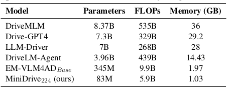
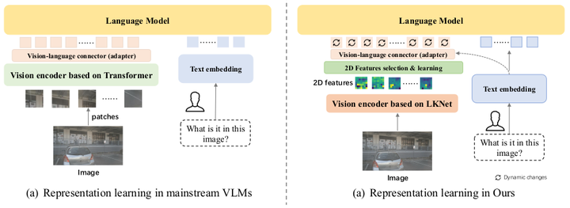
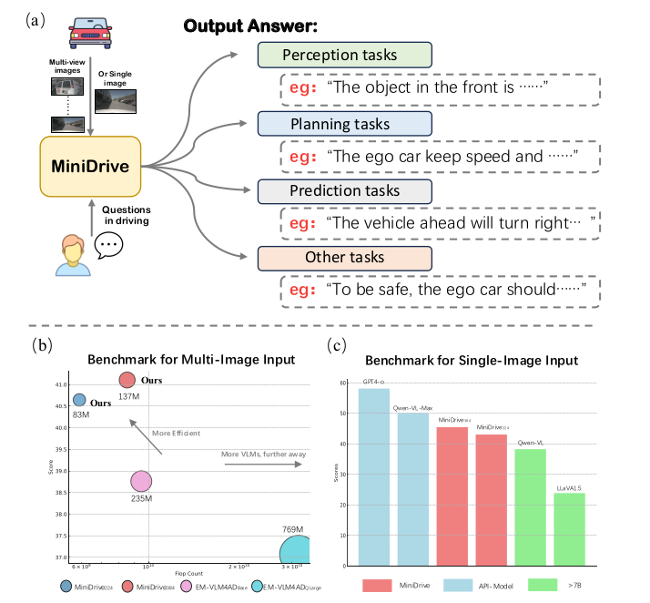
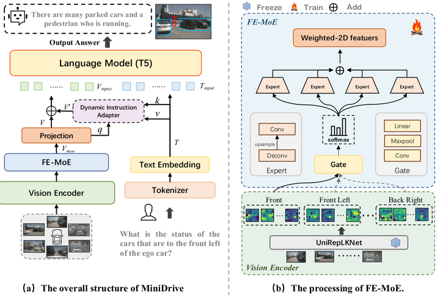
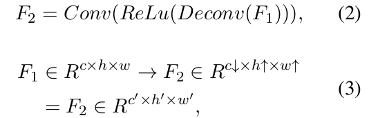
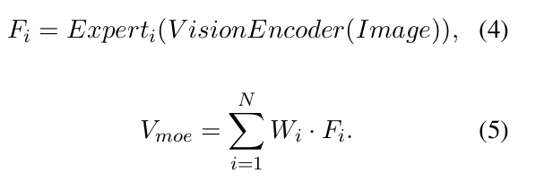
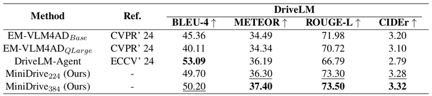
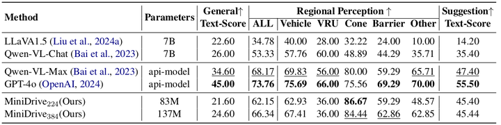

# MiniDrive: More Efficient Vision-Language Models with Multi-Level 2D Features as Text Tokens for Autonomous Driving [arxiv]
### 🔥 **论文链接：**  
- [MiniDrive: More Efficient Vision-Language Models with Multi-Level 2D Features as Text Tokens for Autonomous Driving](https://arxiv.org/pdf/2409.07267)  
### 🔥 **代码链接：**  
- [GitHub - MiniDrive](https://github.com/EMZucas/minidrive) 抱歉代码还未开源，只有链接，敬请期待！  
### 🔥 **数据集：**  
- [Drive-LM Datasets 下载教程](https://github.com/OpenDriveLab/DriveLM/tree/main/challenge)   
- [CODA-LM Datasets 主页](https://coda-dataset.github.io/coda-lm/)  
- [CODA-LM Datasets 下载教程](https://github.com/DLUT-LYZ/CODA-LM)  

## I) Main Contributions:
- **轻量化**：MiniDrive224模型参数量在83M，浮点运算量5.9B，显存占用1.03GB，计算消耗显著小于其他VLM模型，使得该视觉语言模型的部署和落地成为可能。

    
     
    
Figure1: VLMs通用模型计算消耗多维度Benchmark 

  

- **动态适配性**：主流的VLMs范式是基于***Transformer***的Vision Encoder，通过将图像分patch送入图像编码网络提取特征作为视觉tokens。而***MiniDrive***主干Backbone基于***UniRepLKNet***，采用大卷积核提取图像特征作为视觉tokens，从而解决了传统视觉tokens嵌入不能动态适配不同指令文本嵌入的问题。

    
     
    
Figure2: MiniDrive和主流VLMs架构对比图 

  

## II) What's MiniDrive?

    
     
    
Figure3: (a) 端到端问答系统：具备感知、规划、预测和其他自动驾驶问题功能; (b)多张图片输入下，MiniDrive在Drive-LM evaluation基准上得分表现突出; (c) 单张图片输入下，MiniDrive在CODA-LM evaluation基准上得分接近商业小模型API-Model;
 

  

**MiniDrive**是个仅包含84M参数的轻量化语言模型，它可以在单卡24GB内存的RTX 4090 GPU完成训练。同时，该模型也支持单张和多张图像输入的推理。在自动驾驶中端到段链路中，它具备：感知、规划和预测的问答能力。
## III) MiniDrive Model Structure and Data Stream

    
     
    
Figure4: MiniDrive 模型架构及FE-MoE模块结构
 

  

***MiniDrive***由两部分数据流组成：  
- 1）视觉Pipeline数据流经过以下四个模块：  
    - ***Vision Encoder***：首先，环视图像作为输入会经过***Vision Encoder***，***Vision Encoder*** 模块采用了基于大卷积核的***UniRepLKNet***作为图像编码器的Backbone，提取图像特征。输出的图像FeatureMap维度是***C×H×W***。
    - ***FE-MoE(Feature Engineering Mixture of Experts)***：  紧接着，上游的FeatureMap会通过***Gate***网络生成对应的权重weights。***Gate***层组成：卷积层+最大池化层+线性层。与此同时，图像特征FeatureMap还会喂入多层Expert层，图像特征FeatureMap维度从C×H×W改变为C'×H'×W'，这是因为Expert层组成为：反卷积+RELU激活层+卷积层。因此，Expert层作用是压缩图像特征通道数，扩大特征图分辨率，获得更多的图像语义信息。最后，图像特征会和Gate计算得到的weights加权得到新的图像特征。经过***FE-MoE***模块的层层编码，图像特征被映射为视觉tokens嵌入。
    

        
         
        
Figure5: Expert层图像特征映射
    

    
  
    

        
         
        
Figure6: FE-MoE各Expert层输出特征加权
    

    
  

    - ***Projection***：FE-MoE输出C'×H'×W'的FeatureMap会经过flatten操作得到***l1×dims'*** Feature, 该特征在送入***projection***层会改变dims'大小，最终得到l1×dims的Feature，从而适配LLM模型输入尺寸的需求。  
    - ***Dynamic Instruction Adapter(DI-Adapter)***： 主流的视觉大语言模型一般采用如下策略：图像特征表征和文本特征表征会被独立送入网络中，相同的图像特征嵌入往往对应着复杂多变的文本特征嵌入。为了解决这个静态映射问题，作者提出了一种新颖的方法：引入***DI-Adapter***模块，该模块可以使图像特征表征嵌入动态适配不同的文本特征嵌入。***DI-Adapter***模块通过将文本输入特征作为key, value, 经过projection输出的图像特征作为query送入cross-attention网络编码。最终，经过cross-attention的输出特征V'会由残差连接同projection层输出特征进行Add操作，以实现多模态增强效果。
- 2）自然语言Pipeline数据流：驾驶员输入指令，经过一般NLP处理方法：Tokenizer: 分词器 + Embeddinglayers:词嵌入层，将输出为***l2 x dim***的文本特征。  

视觉数据流生成的图像tokens嵌入: ***l1Xdim*** 将和自然语言数据流生成的tokens嵌入: ***l2Xdim*** 经过最后的LM模行：T5-small language model，完成指令的答复。  

## Ⅳ‌I)  BenchMark

    
     
    
Figure7: DriveLM 测试集效果对比：在同样的基准下，MiniDrive384各项指标高于EM-VLM4AD模型

  

    
     
    
Figure8: CODA-LM 数据集效果对比：在同样的基准下，MiniDrive各项指标直逼闭源模型

 

**Metric指标含义**
- ***BLEU-4(Bilingual Evaluation Understudy)***： NLP中用于评估自然语言机器译文同参考译文的重合度。重合程度越高就认为译文质量越高。其中，4指计算得分过程中，一个语句里面连续的4个单词组成的片段（4-gram）作为一个单位参与计算。BLEU-4主要关注翻译的精确度，即模型输出与参考译文的词汇重合度。
- ***METEOR (Metric for Evaluation of Translation with Explicit ORdering)***：NLP中评估机器翻译输出质量的指标。与 BLEU 相比，METEOR 考虑了更多的因素，如同义词匹配、词干匹配、词序等。因此，它通常被认为是一个更全面的评价指标。METEOR同时考虑了精确度、召回率和平滑性，更加细致和全面。
- ***ROUGE(Recall-Oriented Understudy for Gisting Evaluation)***：NLP中评估机器翻译同参考译文的重合最长子序列召回率。与BLEU-4指标相比，ROUGE将BLEU-4的4-gram优化为最长公共子序列参与到metric计算。ROUGE专注于召回率而非精确度，评价的是基于字词而非语义的相似度。
- ***CIDEr(Consensus-based Image Description Evaluation)***：把每个句子看成文档，然后计算其 TF-IDF 向量的余弦夹角，据此得到候选机器译文和参考译文的相似度。CIDEr评价的是基于字词而非语义的相似度。